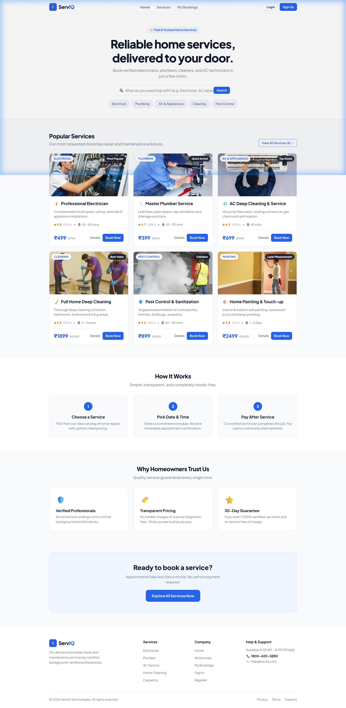
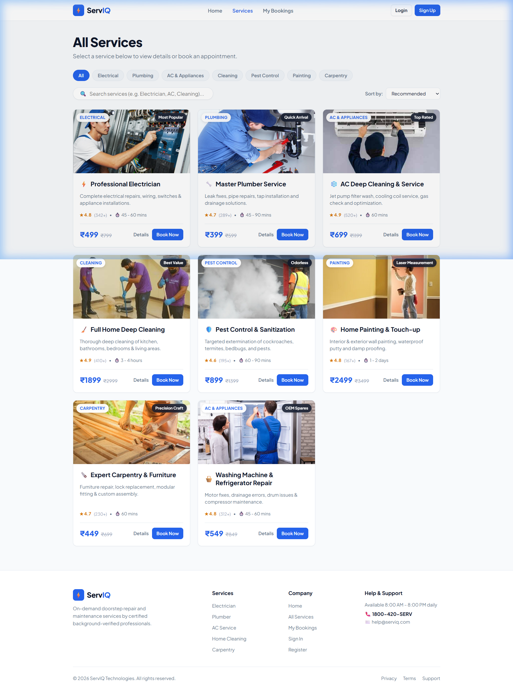
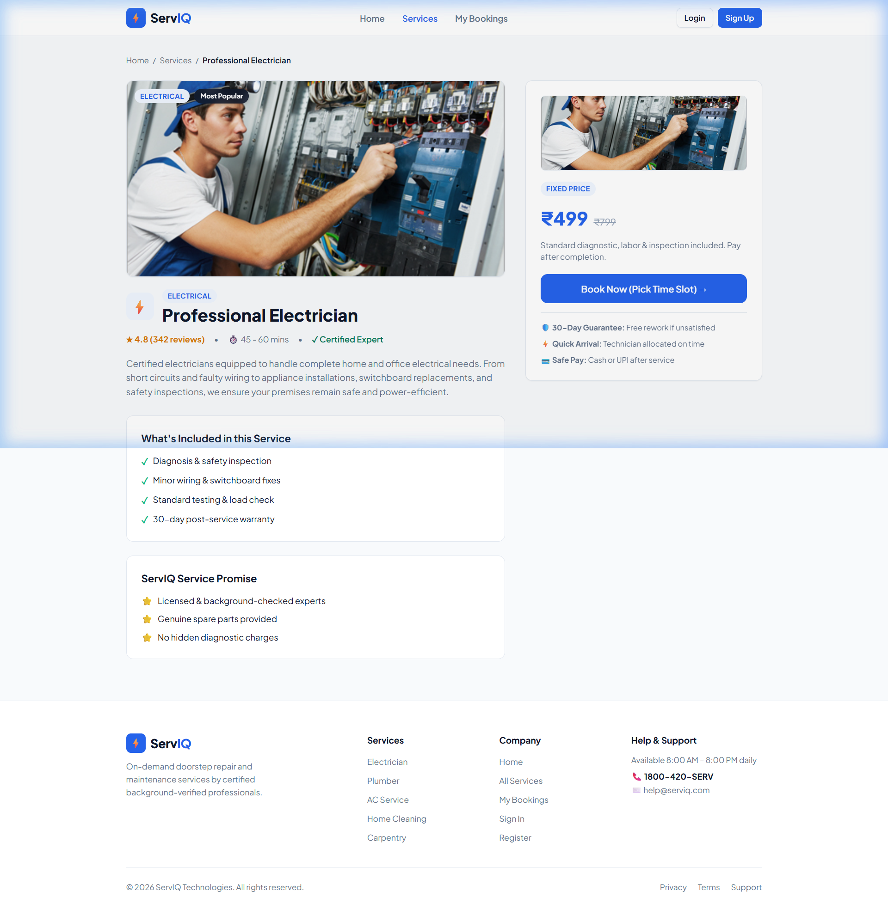
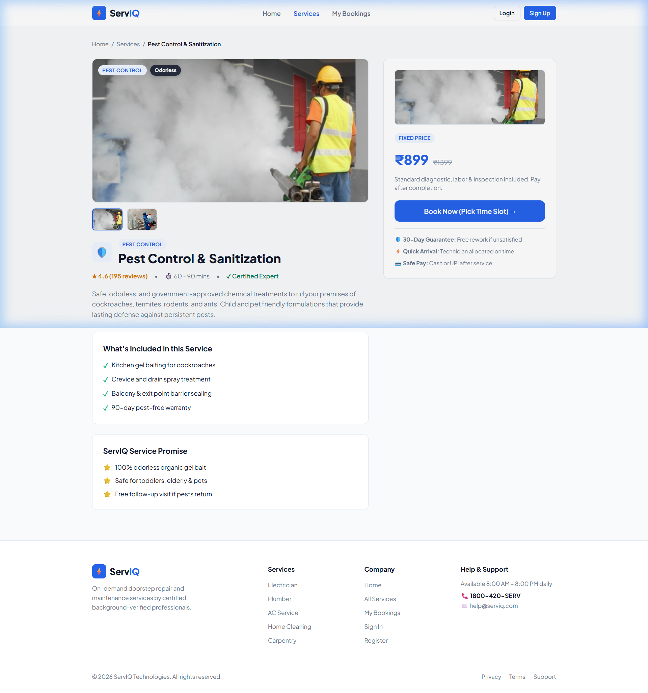
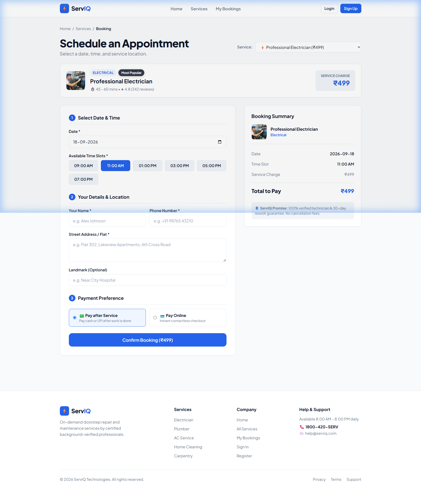
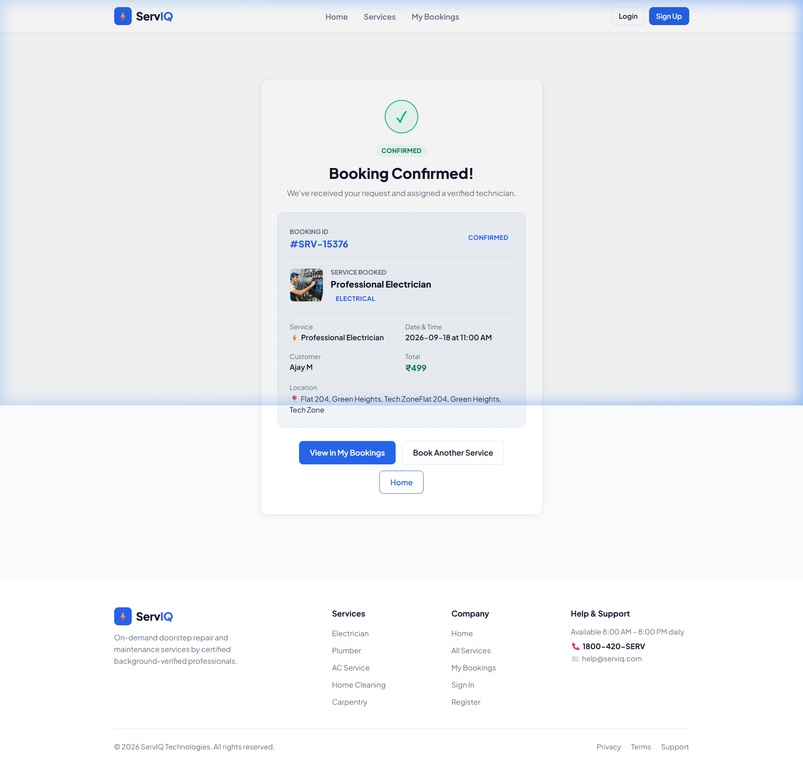
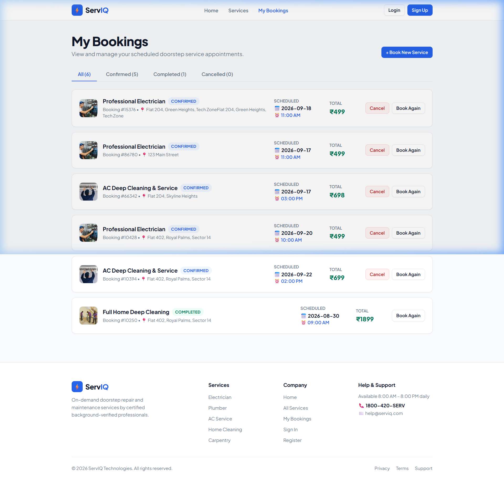

<div align="center">

# ⚡ ServIQ
### **On-Demand Doorstep Home & Electrical Services Booking Platform**

[](https://react.dev/)
[](https://vitejs.dev/)
[](https://developer.mozilla.org/en-US/docs/Web/JavaScript)
[](https://www.w3.org/Style/CSS/)
[](LICENSE)
[](https://github.com/ajaymari74-cyber)

<p align="center">
  <b>A modern, responsive, and intuitive web application connecting homeowners with background-verified service professionals for electrical repairs, plumbing, appliance maintenance, home cleaning, carpentry, and pest control.</b>
</p>

[Explore Features](#-key-features) •
[Screenshots](#-application-walkthrough--screenshots) •
[Tech Stack](#-technology-stack) •
[Quick Start](#-getting-started) •
[Author & Copyright](#-author--copyright)

---

</div>

## 📌 Executive Overview

**ServIQ** solves the pervasive friction of hiring certified, punctual, and reliable domestic service technicians in urban households. Traditional local contractor hiring often suffers from opaque pricing, unverified credentials, lack of warranties, and disorganized scheduling.

ServIQ redefines the home maintenance experience by providing:
- **Transparent, Upfront Pricing:** Zero hidden diagnostic costs or surprise fees.
- **Background-Verified Experts:** Rigorously vetted electricians, plumbers, and mechanics.
- **30-Day Free Rework Guarantee:** Complete peace of mind for every completed service.
- **Frictionless 3-Step Scheduling:** Book appointments in under 60 seconds with instant confirmation.
- **Flexible Payment Modes:** Pay after service inspection via Cash or Digital UPI/Card.

---

## 🚀 Key Features

### 🔍 1. Service Catalog Discovery & Instant Search
- **Instant Search:** Real-time search bar filtering across service titles, descriptions, and domain keywords.
- **Category Filter Tabs:** Quick navigation across 8 domestic repair domains (Electrical, Plumbing, AC & Appliance Repair, Home Cleaning, Carpentry, Painting, Pest Control).
- **Multi-Criteria Sorting:** Sort services by Recommended/Popularity, Customer Ratings (High-to-Low), and Pricing (Low-to-High / High-to-Low).

### 🖼️ 2. Rich Media & Interactive Service Details
- High-definition photography with interactive **multi-view image galleries** (e.g. Pest Control & Sanitization inspection views).
- Clear breakdown of **Service Inclusions** (What's Included vs. What's Excluded).
- Dynamic duration estimates, safety certifications, and warranty badges.
- One-click transition directly into the booking checkout pipeline.

### 📅 3. Frictionless 3-Step Appointment Scheduling
- **Date Picker:** Clean date selection with minimum-date restriction (prevents scheduling past dates).
- **Time Slot Selector:** 6 structured daily appointment slots from Morning (08:00 AM) to Evening (06:00 PM).
- **Customer Details & Address Input:** Auto-fills verified user details if logged in, including delivery address and optional landmarks.
- **Payment Method Preference:** Seamless choice between *"Pay after Service (Cash/UPI)"* and *"Pay Online"*.

### 🧾 4. Official Booking Confirmed Receipt
- Real-time generation of a verifiable receipt upon successful checkout.
- Unique formatted Reference ID (e.g., `#SRV-15376`).
- Details technician assignment, total price, appointment timestamp, and full service breakdown.
- Direct quick actions to print receipt, view appointment in *"My Bookings"*, or return to home.

### 📋 5. Persistent "My Bookings" Dashboard
- Fully persistent client-side data layer powered by browser **LocalStorage**.
- Status filtering tabs: **All**, **Confirmed**, **Completed**, and **Cancelled**.
- Interactive appointment cards with technician info, date, time slot, and price badge.
- Secure **Cancellation Flow** with an interactive confirmation modal.

### 🔐 6. User Authentication & Session Management
- Centralized `AuthContext` managing authentication lifecycle across the app.
- Multi-tier support: Integrated with **MockAPI** cloud endpoints alongside local fallback storage.
- Auto-syncs registered user details into active booking forms.

---

## 📸 Application Walkthrough & Screenshots

<div align="center">

### 1. Modern Landing Page & Hero Discovery

*Hero section with instant service query bar, popular service cards, and 3-step value proposition.*

---

### 2. Comprehensive All Services Catalog

*Interactive category filtering pills, real-time search, and price/rating sorting.*

---

### 3. Detailed Service Overview & Inclusions

*Service breakdown featuring duration, warranty badge, what's covered, and pricing card.*

---

### 4. Interactive Multi-Photo Gallery

*Interactive multi-thumbnail gallery allowing homeowners to inspect equipment and before/after results.*

---

### 5. 3-Step Appointment Booking Form

*Frictionless checkout with live date picker, time slot selector, address fields, and order summary.*

---

### 6. Official Confirmed Booking Receipt

*Verifiable booking receipt with unique ID (`#SRV-15376`), appointment schedule, and technician assignment.*

---

### 7. Real-Time "My Bookings" Dashboard

*Management dashboard with real-time status filtering (All, Confirmed, Completed, Cancelled) and cancellation modal.*

</div>

---

## 🛠️ Technology Stack

| Layer | Technology | Purpose |
| :--- | :--- | :--- |
| **Frontend Framework** | [React.js 19](https://react.dev/) | Modern component architecture, functional hooks, virtual DOM |
| **Build & Bundler** | [Vite 8](https://vitejs.dev/) | Ultra-fast Hot Module Replacement (HMR) and optimized production bundle |
| **Routing** | [React Router v7](https://reactrouter.com/) | Declarative client-side routing, URL parameters, and scroll restoration |
| **State Management** | React Context API & Hooks | Global authentication state (`AuthContext`) and local reactive states |
| **Styling & Theme** | Modern Vanilla CSS3 | Custom CSS variables, Glassmorphism, CSS Grid & Flexbox, smooth micro-interactions |
| **Data Persistence** | Web LocalStorage API | Client-side persistence for appointment records, user sessions, and cache |
| **Backend Integration** | MockAPI (REST) & Local Fallback | Cloud user registration and login endpoints with fallback mechanisms |
| **Code Quality** | Oxlint | High-performance JavaScript and React linting |

---

## 📁 Project Directory Structure

```text
serviq/
├── documentation_screenshots/      # High-resolution application screenshots
│   ├── 01_home_page.png
│   ├── 02_all_services_catalog.png
│   ├── 03_service_details_electrician.png
│   ├── 04_service_details_pest_control_gallery.png
│   ├── 05_schedule_appointment_booking.png
│   ├── 06_booking_confirmed_receipt.png
│   └── 07_my_bookings_dashboard.png
├── public/                         # Static assets & brand icons
│   ├── favicon.png
│   ├── favicon.svg
│   └── serviqlogo.png
├── src/
│   ├── assets/                     # Optimized service banner photographs
│   ├── Components/                 # Modular, reusable UI components
│   │   ├── BookingForm.jsx         # 3-step checkout appointment form
│   │   ├── Button.jsx              # Reusable button with variants (primary/outline/sm/lg)
│   │   ├── Footer.jsx              # Global footer with copyright notices
│   │   ├── NavBar.jsx              # Responsive navigation bar with mobile toggle
│   │   ├── ServiceCard.jsx         # Card component displaying service preview
│   │   └── ServiceList.jsx         # Catalog grid with filtering and sort logic
│   ├── context/
│   │   └── AuthContext.jsx         # User authentication state provider
│   ├── data/
│   │   └── servicesData.js         # Comprehensive 8-category service dataset
│   ├── pages/
│   │   ├── Booking.jsx             # Appointment booking page
│   │   ├── BookingSuccess.jsx      # Confirmed booking receipt view
│   │   ├── Home.jsx                # Landing page & feature highlights
│   │   ├── Login.jsx               # User sign-in page
│   │   ├── MyBookings.jsx          # Bookings management dashboard
│   │   ├── Register.jsx            # User registration with MockAPI sync
│   │   ├── ServiceDetails.jsx      # Service details page with multi-view gallery
│   │   └── Services.jsx            # Catalog discovery view
│   ├── services/
│   │   └── mockApi.js              # REST client for MockAPI & local authentication
│   ├── utils/
│   │   └── bookingStorage.js       # LocalStorage CRUD utilities for bookings
│   ├── App.css                     # Comprehensive design system stylesheet
│   ├── App.jsx                     # Root application layout & route definitions
│   ├── index.css                   # CSS reset, typography, and base tokens
│   └── main.jsx                    # React DOM root entry point
├── index.html                      # HTML5 entry point with SEO metadata
├── package.json                    # Project configuration & dependencies
├── vite.config.js                  # Vite configuration
└── README.md                       # Professional project documentation
```

---

## ⚡ Getting Started

### Prerequisites
Make sure you have the following installed on your machine:
- **Node.js**: `v18.0.0` or higher ([Download Node.js](https://nodejs.org/))
- **npm**: `v9.0.0` or higher (bundled with Node.js)
- **Git**: ([Download Git](https://git-scm.com/))

### Installation Steps

1. **Clone the Repository:**
   ```bash
   git clone https://github.com/ajaymari74-cyber/servicebookingapplication.git
   cd servicebookingapplication
   ```

2. **Install Dependencies:**
   ```bash
   npm install
   ```

3. **Start the Development Server:**
   ```bash
   npm run dev
   ```
   Open your browser and navigate to:
   ```text
   http://localhost:5173
   ```

4. **Build for Production:**
   ```bash
   npm run build
   ```

5. **Preview Production Build:**
   ```bash
   npm run preview
   ```

---

## 🧪 Available Scripts

| Command | Action |
| :--- | :--- |
| `npm run dev` | Starts the local Vite development server with Hot Module Replacement (HMR). |
| `npm run build` | Compiles and optimizes assets into the `dist/` production folder. |
| `npm run preview` | Runs a local web server to preview the production build. |
| `npm run lint` | Runs Oxlint to verify code quality and style adherence. |

---

## 👨‍💻 Author & Copyright

**ServIQ** was conceptualized, designed, and developed by:

### **Ajay M**
*Junior Software Developer*  
- **GitHub:** [@ajaymari74-cyber](https://github.com/ajaymari74-cyber)  
- **Project Repository:** [servicebookingapplication](https://github.com/ajaymari74-cyber/servicebookingapplication)

```text
© 2026 ServIQ Technologies.
Copyright © 2026 Ajay M. All rights reserved.
```

---

## 📄 License

This project is licensed under the **MIT License** – see the [LICENSE](LICENSE) file for details.
